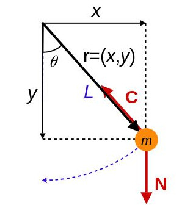

```{r setup, include = FALSE}

knitr::opts_chunk$set(
  collapse = TRUE,
  comment = "#>",
  fig.width=8, fig.height=8
)
```

```{r, fig.show='hold'}
library(deSolve)
```

## Ecuaciones diferenciales algebraicas

Un sistema de ecuaciones diferenciales algebraicas es un sistema de ecuaciones que consiste en una ecuación diferencial ordinaria(EDO) además de una ecuación algebraica, ambas ecuaciones deben ser satisfechas simultáneamente.   

El paquete **deSolve** contine dos funciones que resuelven el problema de valor inicial de ecuaciones diferenciales algebraicas:   

-   **radau** que implementa el algoritmo de Runge-Kutta RADAU5   
-   **daspk** basado en DASPK    

La función **radau** necesita una entrada de la forma: $My'=f(t,y,y')$ donde $M$ es la matriz masa.   

La función **daspk** puede recibir la misma entrada, pero también puede resolver un problema escrito de la forma $F(t,y,y')=0$   


### **DAEs con indice maximal 1**    

La función **daspk** del paquete deSolve resuelve (de manera relativamente simple) DAEs con indice maximal 1.    
Consideramos el siguiente DAE:   

\begin{gather*} 
\frac{dy_1}{dt}=y_2\\
t = y_1
\end{gather*}

donde la primera ecuación es una ecuación diferencial y la segunda es una ecuación algebraica.   
Para resolverlo:

```{r, fig.show='hold'}

daefun <- function(t, y, dy, parameters) 
{
  res1 <- dy[1] - y[2]
  res2 <- -y[1] + t
  list(c(res1, res2))
}

yini  <- c(0, 1)
dyini <- c(1, 0)
times <- seq(0, 10, 0.1)

system.time(out <- daspk(y = yini, dy = dyini,
            times = times, res = daefun, parms = 0))
  
matplot(out[,1], out[,2:3], type = "l", lwd = 2,
 main = "dae", xlab = "time", ylab = "y")

```
Los pararámetros de la función daspk son:    
```
  daspk(y, times, func = NULL, parms, nind = c(length(y), 0, 0), 
  dy = NULL, res = NULL, nalg = 0, 
  rtol = 1e-6, atol = 1e-6, jacfunc = NULL,
  jacres = NULL, jactype = "fullint", mass = NULL, estini = NULL,
  verbose = FALSE, tcrit = NULL, hmin = 0, hmax = NULL,
  hini = 0, ynames = TRUE, maxord = 5, bandup = NULL,
  banddown = NULL, maxsteps = 5000, dllname = NULL,
  initfunc = dllname, initpar = parms, rpar = NULL,
  ipar = NULL, nout = 0, outnames = NULL,
  forcings=NULL, initforc = NULL, fcontrol=NULL,
  events = NULL, lags = NULL, ...)
```
Donde algunos de los parámetros más importantes son:  

- ***y:*** Son los valores iniciales para el sistema DE  

- ***times:*** Secuencia de tiempo que se busca para la sálida    

- ***func:*** Se usa si el modelo es un ODE o un DAE escrito de forma lineal implícita de la forma (My'=f(t,y)). Tiene que ser definida de la forma ***func <- function(t, y, parms, ...)

- ***parms:*** vector o lista de los parametros usados en 'func', 'jacfunc' o 'res'   

- ***nind:*** Si el sistema DAE: es un vector 3-valuado con el número de variables con índice 1, 2, 3 respectivamente, la ecuación tiene que ser definida variables de índice 1, precedidas de las variables de índice 2, precedidas de las variables de índice 3. La suma de los índices tiene que ser igual a N.   

- ***dy:*** Las derivadas iniciales de las variables de estado del sistema DE, se ignora si es un ODE   

- ***res:*** Si es un sistema DAE: tanto una R-function que computa los residuos \(F(t,y,')\) del DAE en tiempo 't' o el string de caracteres que da el nombre de una función compilada dinámicamente en una biblioteca compartida.   

- ***nalg:*** Si es un DAE: el numero de ecuaciones algebraicas   

- ***rtol:*** Tolerancia del error relativo, puede se un escalar o un vector, uno por cada y    

- ***atol:*** Tolerancia del error absoluto,  puede se un escalar o un vector, uno por cada y    

- ***jacfunc:*** Si no es 'NULL', es una R function que computa el jacobiano del distema de ecuaciones diferenciales.   

- ***jactype:*** La estructura del jacobiano, es "fullint", "fullusr", "bandusr" o "bandint"   

- ***mass:*** La función masa   

- ***hmim:*** Mínimo opcional para el tamaño de los saltos de la integral   

- ***hmax:*** Máximo opcional para el tamaño de los saltos de la integral    

- ***hini:*** Tamaño de salto inicial   

- ***maxord:*** Tamaño de orden máximo permitido   


### **DAEs con índice hasta 3**   
Para esto usaremos la función **radau**.   
Consideramos el problema del péndulo:    

{width='300px'}   
Con ecuación:
\begin{align*}  
x'& = u \\
y'& = v \\
u'& = -\lambda x \\
v'& = -\lambda y - g \\ 
0 & = x^2 + y^2 - L^2 
\end{align*}  

Para resolverlo:   

```{r, fig.show='hold'}
#Definimos el DAE
pendulo <- function (t, L, Y, parms) 
{
    with (as.list(Y),
        list(c(u,
               v,
               -lam*x,
               -lam*y-9.8,
                x^2+y^2-L^2
        ))
    )
}

#Valores iniciales
yini <- c(x = 1, y = 0, u = 0, v = 1, lam = 1)

#Calculamos la matriz masa
M <- diag(nrow = 5)
M[5, 5] <- 0
M
```   
```{r, fig.show='hold',fig_width=10,fig_height=10}
# Calculamos la solución usando radau
index <- c(2, 2, 1)
times <- seq(from = 0, to = 10, by = 0.01)
out <- radau (y = yini, func = pendulo, L=1, parms = NULL,
              times = times, mass = M, nind = index)

plot(out, type = "l", lwd = 2)
plot(out[, c("x", "y")], type = "l", lwd = 2)
```

Los parámetros de la función radau son:   
```
radau(y, times, func, parms, nind = c(length(y), 0, 0), 
  rtol = 1e-6, atol = 1e-6, jacfunc = NULL, jactype = "fullint", 
  mass = NULL, massup = NULL, massdown = NULL, rootfunc = NULL,
  verbose = FALSE, nroot = 0, hmax = NULL, hini = 0, ynames = TRUE,
  bandup = NULL, banddown = NULL, maxsteps = 5000, 
  dllname = NULL, initfunc = dllname, initpar = parms, 
  rpar = NULL, ipar = NULL, nout = 0, outnames = NULL, 
  forcings = NULL, initforc = NULL, fcontrol = NULL,
  events=NULL, lags = NULL, ...)
```
Donde algunos de los parámetros más importantes son:  

- ***y:*** Son los valores iniciales para el sistema ODE  

- ***times:*** Secuencia de tiempo que se busca para la sálida    

- ***func:*** Se usa si el modelo es un ODE o un DAE escrito de forma lineal implícita de la forma (My'=f(t,y)). Tiene que ser definida de la forma ***func <- function(t, y, parms, ...)

- ***parms:*** vector o lista de los parametros usados en 'func', 'jacfunc'     

- ***nind:*** Si el sistema DAE: es un vector 3-valuado con el número de variables con índice 1, 2, 3 respectivamente, la ecuación tiene que ser definida variables de índice 1, precedidas de las variables de índice 2, precedidas de las variables de índice 3. La suma de los índices tiene que ser igual a N.   

- ***rtol:*** Tolerancia del error relativo, puede se un escalar o un vector, uno por cada y    

- ***atol:*** Tolerancia del error absoluto,  puede se un escalar o un vector, uno por cada y    

- ***jacfunc:*** Si no es 'NULL', es una R function que computa el jacobiano del distema de ecuaciones diferenciales.   

- ***jactype:*** La estructura del jacobiano, es "fullint", "fullusr", "bandusr" o "bandint"   

- ***mass:*** La función masa  

- ***massup:*** Número de valores distintos de 0 por encima de la diagonal de la matriz 'mass'   

- ***massdown:***  Número de valores distintos de 0 por debajo de la diagonal de la matriz 'mass'   

- ***verbose:*** Si es TRUE imprime la salida completa en la pantalla

- ***ynames:*** Si es 'FALSE' los nombres de las variables de estado no se pasan a la función 'func', puede acelerar la simulación   

- ***hmax:*** Máximo opcional para el tamaño de los saltos de la integral    

- ***hini:*** Tamaño de salto inicial   

- ***maxord:*** Tamaño de orden máximo permitido   

- ***events:*** Una matriz o dataframe que especifíca los eventos
